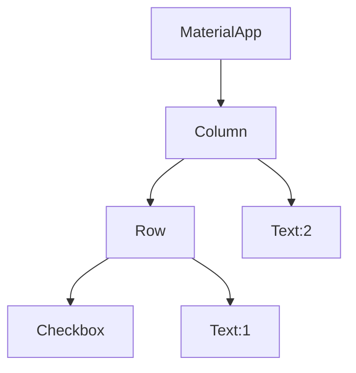
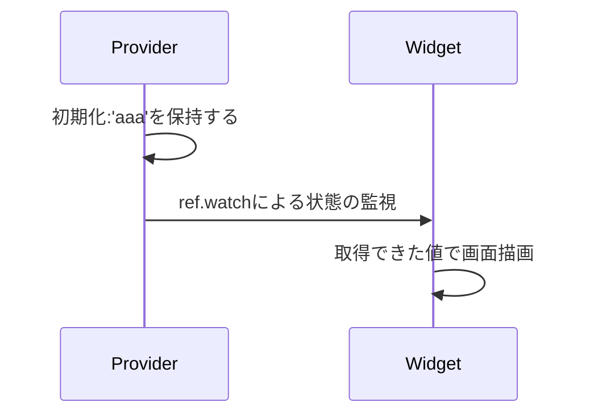
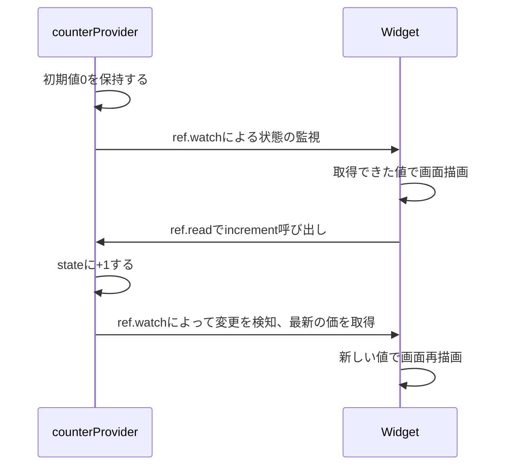
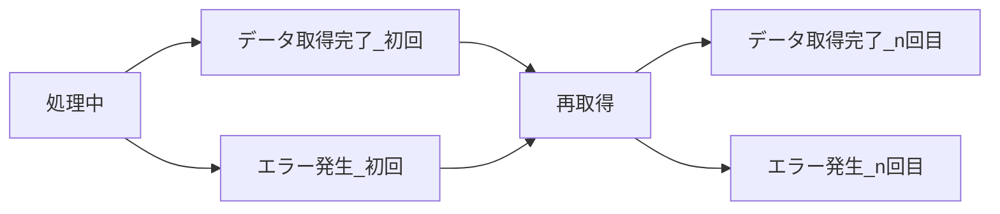

---
# You can also start simply with 'default'
theme: default
# random image from a curated Unsplash collection by Anthony
# like them? see https://unsplash.com/collections/94734566/slidev
background: https://cover.sli.dev
# some information about your slides (markdown enabled)
title: Welcome to Slidev
info: |
  ## Slidev Starter Template
  Presentation slides for developers.

  Learn more at [Sli.dev](https://sli.dev)
class: text-center
# https://sli.dev/features/drawing
drawings:
  persist: false
# slide transition: https://sli.dev/guide/animations.html#slide-transitions
transition: slide-left
# enable MDC Syntax: https://sli.dev/features/mdc
mdc: true
---

# Flutter チュートリアル

---
layout: section
---

# Flutterの基本

---

## WidgetによるUI構築

Widget：TextやCheckbox、ColumnやRowなどUIの構造や要素、それらを使用した構造など、UIの構築要素を指す\
UIの構築はこのWidgetをツリー状に配置して全体のUIを構築する

<div grid="~ cols-2">

<div>



</div>

<div>

```dart
void main() {
  runApp(const MyApp());
}
class MyApp extends StatelessWidget {
  const MyApp({super.key});

  Widget build(BuildContext context) {
    return MaterialApp(
      home: Column(children: [
        Row(children: [
          Checkbox(
            value: true,
            onChanged: (value) {},
          ),
          Text('sample text1'),
        ]),
        Text('sample text2'),
      ]),
    );
  }
}
```

</div>
</div>

---

## StatelessWidgetでWidgetを自作する

基本はStatelessWidgetを継承してWidgetを作成しUIを構築していく

<div grid="~ cols-2">

<div>

```dart
class SampleWidget extends StatelessWidget {
  const SampleWidget({super.key});

  @override
  Widget build(BuildContext context) {
    return Scaffold(
      body: const Center(
        child: SampleTextWidget(),
      ),
    );
  }
}

class SampleTextWidget extends StatelessWidget {
  const SampleTextWidget({super.key});

  @override
  Widget build(BuildContext context) {
    return Text('sample');
  }
}

```

</div>

<div>

image

</div>

</div>

---

## StatefulWidgetを使うな

StatefulWidgetを継承したWidgetを定義、その中で変数を動的に管理することで画面の動的な変更を描画することができる\
しかし、これには以下のようにいくつも欠点がある

<div style="font-size: 14px">

- 状態の再利用性が低い\
  手動で親子間で変数の授受を行わなければならない
- 状態の永続化が困難\
  状態がWidgetと直接紐づいているため永続化しづらい
- 再描画効率の悪さ\
  setStateによって状態を更新すると、そのWidget全体が再描画される可能性がある
- 可読性の低下\
  Widget内部にロジックが書かれやすいため、可読性が悪くなりがち
- ステートの解放が手動\
  disposeやinitStateを手動で行って初期化・解放する必要があり非効率
- テストが難しい\
  ロジックとUIが絡み合ってしまい、ユニットテストしづらい

</div>

これらを含む様々な問題を解決するためにRiverpodがある\
そのため、ここではStatefulWidgetの存在の紹介だけしておく\
使用する際には注意すること


---
layout: center
---

# Riverpod

---

## Riverpodとは

[Riverpod](https://riverpod.dev/ja/): Flutterのライブラリで、Providerを使ってどのWidgetからもアクセスできる状態を管理する

- グローバルな状態管理\
  Providerを使って、どこからでもアクセスできる状態を簡単に作成し管理できる
- 再レンダリングの制御\
  状態が変わった時に必要な部分だけを再レンダリングするため、パフォーマンスを最適化する
- 依存性の管理\
  他のプロバイダに依存するプロバイダを簡単に定義でき、状態の流れを整理しやすい

Riverpodのライブラリは以下の3つがある

- [riverpod](https://pub.dev/packages/riverpod): Dartのみ使用する場合
- [flutter_riverpod](https://pub.dev/packages/flutter_riverpod): FlutterでRiverpodのみ使用する場合
- [hooks_riverpod](https://pub.dev/packages/hooks_riverpod): Riverpodとflutter_hooksを使用する場合

基本的にFlutterとflutter_hooksを使用するのでhooks_riverpodを選択する\
flutter_hooksについては後述する

---

## Riverpodによる状態管理の基本

Riverpodの構成要素は大きく分けて2つ

- Provider\
  変数をグローバルに提供するための入れ物\
  Providerにはいくつか種類がある(詳細は次頁)
- ref\
  Providerにアクセスするために使用するオブジェクト

Providerによって変数を提供し、refによってその変数に対して取得・操作する\
というのがRiverpodのざっくりとした使い方である

---

## Providerの種類

Providerには様々な種類があり、一覧で記述しておく\
各Providerについて詳細は後述する\
(StateProvider・StateNotifierProviderもあるが非推奨)

| Provider | 最も単純なProvider、別Providerのフィルタや計算結果を提供するProvider |
| --- | --- |
| NotifierProvider | クラスで制御する値を制御するProvider  |
| AsyncNotifierProvider | クラスで制御するAsyncValueの値を提供するProvider |
| FutureProvider | AsyncValueを提供する非同期な初期化をするProvider |
| StreamProvider | Streamを提供するProvider |
| ChangeNotifier (*基本的に非推奨) | mutableな複雑な状態管理を行うProvider |


<!--
DartでMacroが使えるようになるとマクロによる定義が標準になるだろう
要加筆修正として考えておく
-->

---

## refの使い方

Providerにアクセスするためのrefの使い方一覧も記述しておく\
実際の使い方は各Providerの紹介の時に記述している

| ref.read | Providerの値を取得する |
| --- | --- |
| ref.watch | Providerの提供する値を監視して、変更があれば再構築する |
| ref.invalidate | Providerを再初期化する |
| ref.refresh (*非推奨) | Providerを再初期化した後、値を取得する |
| ref.listen | Providerの提供する値を監視して、変更があれば任意の関数を実行する |
| ref.listenManual | buildの外でlistenするときに使う |

---


### Provider

Providerを使った基本的なコードを記述する

- Providerで提供する型をジェネリクスに指定しつつ、提供する値を記述する
- `ConsumerWidget`を継承するとbuildの引数に`ref`オブジェクトを取ることができる\
  この`ref`を使って`ref.watch`することで、Providerが提供する値を読み取ることができる

<div grid="~ cols-2">
<div>

Providerの基本のサンプルコード
```dart
final sampleProvider = Provider<String>((ref) => 'aaa');

// widget
class SampleWidget extends ConsumerWidget {
  const SampleWidget({super.key});

  Widget build(BuildContext context, WidgetRef ref) {
    return Text(ref.watch(sampleProvider)); // aaa
  }
}

```
</div>

<div>



</div>
</div>

---

### Provider

Providerの定義時に`ref`を使用できるため\
`ref.watch`などで別のProviderが提供する値を取得することができる\
また、初期化やその順番はProviderが上手く行ってくれるので実装者が気にする必要はない

```dart
final singleProvider = Provider<int>((ref) => 10);
final doubleProvider = Provider<int>((ref) {
  return ref.watch(singleProvider) * 2;
})

// widget
Text((ref.watch(singleProvider)).toString()) // 10
Text((ref.watch(doubleProvider)).toString()) // 20
```

---

### FutureProvider

基本的なProviderのFuture版\
非同期な値を提供するため、AsyncValueとして値を提供するProvider
AsyncValueについては後述する

サンプルコード
```dart
final sampleProvider = FutureProvider<int>((ref) async {
  await Future.delayed(const Duration(seconds: 1));
  return 10;
});

class SampleWidget extends ConsumerWidget {
  const SampleWidget({super.key});

  @override
  Widget build(BuildContext context, WidgetRef ref) {
    final asyncVal = ref.watch(sampleProvider);
    return switch (asyncVal) {
      AsyncData<int>(:final int value) => Text('$value'),
      AsyncError<int>(:final error) => Text('Error: $error'),
      _ => CircularProgressIndicator(),
    };
  }
}
```

---

### StreamProvider

基本的なProviderのStream版\
Futureと同じで非同期な値を提供するため、AsyncValueとして値を提供するProvider

しかし、これまでのProvider・FutureProvider・StreamProviderだけでは提供する値に後から変更を加えることが難しい\
そこで使用するのがNotifierProviderである


---

### NotifierProvider

NotifierProviderはProviderと違い、提供する値を更新するメソッドも提供する\
また、`ref.read(**.notifier)`で提供されるメソッドにアクセスできる

```dart
final counterProvider = NotifierProvider<CounterNotifier, int>(CounterNotifier.new);

class CounterNotifier extends Notifier<int> {
  @override
  int build() {
    // refはここでも使える
    return 0;
  }
  void increment() {
    state += 1;
  }
}

// widgetで以下のように記述する
TextButton(
  child: Text(
    'カウンター: ${ref.watch(ref.watch(counterProvider))}'
  ),
  onPressed: () {
    ref.read(counterProvider.notifier).increment(); // increment呼び出し
  },
)
```

---

### NotifierProvider

<div style="display:flex;">

<div style="width:45%;">

前頁例で出てきた`state`について
- NotifierProviderが提供する値そのものを指す\
  (前頁例ではint型変数)
- `state`に対して操作することで提供する値が変わる\
  (前頁例では`increment()`でstateを更新していた)

右図で前頁例における動作の流れを示しておく

ref.watchで監視しておくと、状態が更新されると更新された値で自動でUIが更新される

</div>

<div style="width:55%;">



</div>
</div>

---

### AsyncNotifierProvider

非同期処理における状態を管理するためのAsyncValueを提供するNotifierProvider\
ProviderとNotifierProvider・FutureProviderとAsyncNotifierProviderといった対応になっている

```dart
final sampleProvider = AsyncNotifierProvider<SampleNotifier, int>(
  SampleNotifier.new,
);
class SampleNotifier extends AsyncNotifier<int> {
  @override
  Future<int> build() async {
    await Future.delayed(const Duration(seconds: 1));
    return 0;
  }
}
// widget側
return switch (ref.watch(sampleProvider)) {
  AsyncData<int>(:final value) => Text('$value'),
  AsyncError<int>(:final error) => Text('$error'),
  _ => CircularProgressIndicator(),
};
```

---

### StreamNotifierProvider

Stream処理における状態を管理するためのAsyncValueを提供するNotifierProvider\
StreamProviderに対するStreamNotifierProviderになるが、あまり使用する場面がない

```dart
final sampleProvider = StreamNotifierProvider<SampleNotifier, int>(
  SampleNotifier.new,
);
class SampleNotifier extends StreamNotifier<int> {
  @override
  Stream<int> build() async* {
    final streamList = Stream<int>.fromIterable(
      List<int>.generate(10, (i) => i + 1),
    );
    await for (final val in streamList) {
      await Future.delayed(const Duration(seconds: 1));
      yield val;
    }
  }
}
// widget側
return switch (ref.watch(sampleProvider)) {
  AsyncData<int>(:final value) => Text('$value'),
  AsyncError<int>(:final error) => Text('$error'),
  _ => CircularProgressIndicator(),
};
```

---


### AsyncValueについて

これまで出てきたAsyncValueについて説明する\
AsyncValueを一言で表すなら**非同期でデータを取得するときに発生し得る全ての状態を表現するためのクラス**である



図のような非同期処理における特定の状態を持ったAsyncValueを使用することで\
どのような状況で画面にどういった情報を表示するかを制御することができるようになる

---

### AsyncValueについて

AsyncValueは抽象クラスで、3つの具象クラスにわけられる

- AsyncData
- AsyncError
- AsyncLoading

また、3つのパラメータを持っている

- value\
  hasValueでvalueがnullかどうかをチェックできる
- error\
  hasErrorでerrorがnullかどうかをチェックできる
- isLoading

これらを組み合わせて前述した状態を表現することができるようになる\
(例： `asyncVal is AsyncData && asyncVal.isLoading == true`などが存在し得る)

---

### AsyncValueによる画面描画切り替え

AsyncValueが持つ状態に応じてUI側でどのように描画するのかをwidgetで記述する

switchによる簡単な条件分岐の書き方
```dart
switch(ref.watch(sampleProvider)) {
  AsyncData(:final value) => Text(value.toString()), 
  AsyncError(:final error) => Text('$error'),
  _ => CircularProgressIndicator(),
}
```

`isLoading`,`hasValue`,`hasError`を使用して、さらに詳細な条件分岐を記述することができる

```dart
switch(ref.watch(sampleProvider)) {
  // AsyncDataで、loadingがfalseの場合
  AsyncData<int>(:final value, isLoading: false) => Text('$value'),
  // AsyncDataでありながら、loadingがtrueの場合
  AsyncData<int>(:final value, isLoading: true) => Text('$value && loading'),
  AsyncError<int>(:final error) => Text('$error'),
  _ => CircularProgressIndicator(),
}
```

文法としてのswitch式における条件分岐の記述方法は[公式](https://dart.dev/language/branches)を参照する

---

### AsyncValueによる画面描画切り替え

---

### AsyncValueによる画面描画切り替え(when)

whenなどを使った書き方\
これは3状態についてメソッドで切り替える方法

これはswitchによる分岐と違ってhasValueなどでの分岐の記述が読みづらくなりがちで基本的には非推奨だが、\
switchによる分岐ができるようになる前はこの方法しかなかったため、あらゆるところでこの方法で記述されていることが多い\
そのため、ここでも例示だけはしておく

```dart
ref.watch(sampleProvider).when(
  data: (data) {
    return Text(data.toString());
  },
  error: (error, stackTrace) {
    return Text(error.toString());
  },
  loading: () {
    return CircularProgressIndicator();
  }
)
```

---

## Providerの注意点

Providerが提供する値は、クラスのような参照を表すものの場合、参照が変更されなければ更新されたとして判定されない

<div grid="~ cols-2 gap-4">

<div>

間違った例
```dart
class SampleState {
  SampleState({required this.x});
  int x;
}

final sampleProvider = NotifierProvider<
  SampleStateNotifier,
  SampleState
>(SampleStateNotifier.new);

class SampleStateNotifier extends Notifier<SampleState> {
  @override
  SampleState build() {
    return SampleState(x: 0);
  }

  void increment() {
    state.x += 1; // 参照が更新されないため、UI側に通知されない
  }
}
```

</div>

<div>


正しい例
```dart
class SampleState {
  const SampleState({required this.x});
  final int x;
}

final sampleProvider = NotifierProvider<
  SampleStateNotifier,
  SampleState
>(SampleStateNotifier.new);

class SampleStateNotifier extends Notifier<SampleState> {
  @override
  SampleState build() {
    return SampleState(x: 0);
  }

  void increment() {
    state = SampleState(x: state.x + 1);
  }
}
```

</div>
</div>

---

## copyWithによる更新

Providerでは状態を更新したことをUI側に通知するために、参照を変更する必要があるため、copyWithのようなメソッドをクラスに定義しておくことがよくある\
[freezed](https://pub.dev/packages/freezed)というライブラリを使用するとcopyWithなどのコードが自動生成される

```dart
class SampleState {
  const SampleState({required this.x});
  final int x;
  SampleState copyWith({int? x}) {
    return SampleState(x: x ?? this.x);
  }
}

final sampleProvider = NotifierProvider<SampleStateNotifier, SampleState>(SampleStateNotifier.new);

class SampleStateNotifier extends Notifier<SampleState> {
  @override
  SampleState build() {
    return SampleState(x: 0);
  }

  void increment() {
    state = state.copyWith(x: state.x + 1);
  }
}
```

---

## Providerに付与できる属性について

ProviderにはautoDisposeとfamilyという属性を付与できる

- autoDispose\
  `ref.watch`するものがいなくなると保持している状態を破棄し、メモリを解放する
- family\
  外部のパラメータで一意のProviderを作成できるようになる (例：IDによって別のProviderとして機能するなど)

<div grid="~ cols-2 gap-2">

<div>

autoDispose例
```dart
final sample1Provider = Provider.autoDispose<int>(
  (ref) => 10,
);

final sample2Provider = NotifierProvider.autoDispose<
  Sample2Notifier,
  int
>(Sample2Notifier.new);

class Sample2Notifier extends AutoDisposeNotifier<int> {
  @override
  int build() => 0;
}
```

</div>
<div>

family例
```dart
final sample3Provider = Provider.family<int, String>(
  (ref) => 10,
);

final sample4Provider = NotifierProvider.autoDispose<
  Sample4Notifier,
  int
>(Sample4Notifier.new);

class Sample4Notifier extends FamilyNotifier<int, String> {
  @override
  int build(String arg) => 0;
}
```

</div>
</div>

---
layout: center
---

# Flutter Hooks

---

## Hooksによる状態管理

これまで紹介したRiverpodのProviderではグローバルに定義されているため、基本的にWidget全体で共有される\
[Hooks](https://pub.dev/packages/flutter_hooks)では特定のWidget内部でのみで管理できる変数の定義を行うことができる\
StatelessWidgetではなく、HookWidgetを継承することで使用できる

<div style="display: flex;">

<div style="width: 63%">

Hooksの使用例
```dart
class SampleWidget extends HookWidget {
  const SampleWidget({super.key});
  Widget build(BuildContext context) {
    final isEnabledField = useState<bool>(false);
    return Column(children: [
      TextButton(
        child: Text('toggle'),
        onPressed: () {
          isEnabledField.value = !isEnabledField.value // 更新
        },
      ),
      TextField(
        enabled: isEnabledField.value, // 参照
      ),
    ])
  }
}
```

</div>

<div>

Hookを使用しつつrefも使うといったこともできる
```dart
class SampleWidget extends HookConsumerWidget {
  const SampleWidget({super.key});

  Widget build(BuildContext context, WidgetRef ref) {
    ref.watch(sampleProvider);
    final isSample = useState<bool>(true);
    return Text(isSample.value ? 'sample' : 'foobar');
  }
}

```

</div>
</div>

---

## HooksによるController管理

TextEditingControllerが代表するFlutterで出てくるController系は\
StatefulWidgetで使用することを前提としているため、StatelessWidgetでは基本的に使用できない\
そこで、Hooksを使用することでControllerをStatefulWidgetなしで定義・使用できる

また、Controller系はWidgetと同じライフサイクルであるべきである\
そのため、Hooksを使用することが強く推奨される\
Controller系をProviderなどで管理するよりは、StatefulWidgetを使用するほうがはるかにマシである

```dart
class SampleWidget extends HookWidget {
  const SampleWidget({super.key});

  Widget build(BuildContext context) {
    final editingController = useTextEditingController();
    return TextField(
      controller: editingController,
    );
  }
}
```

---

## Hooksでuse**Controllerを自作する

ライブラリなどで定義されているController系についても自分でuseを定義して使用することができる

```dart
SampleController useSampleController() {
  return use(const _SampleController());
}

class _SampleController extends Hook<SampleController> {
  const _SampleController();
  @override
  _SampleController createState() => _SampleControllerState();
}
class _SampleControllerState extends HookState<SampleController, _SampleController> {
  final SampleController _controller = SampleController();
  @override
  SampleController build(BuildContext context) {
    return _controller;
  }
  @override
  void dispose() {
    super.dispose();
  }
}
```

---
layout: center
---

# パフォーマンス考慮

---

## constによる再描画判定の阻止

Widgetのコンストラクタでlinterにconstを付けるように注意されている場合、constをつけておく\
これだけで、ある程度余計な再描画判定を省くことができる\
簡単で効果的なため、必ず実施する

```dart
class SampleWidget extends StatelessWidget {
  const SampleWidget({super.key});

  @override
  Widget build(BuildContext context) {
    return Scaffold(
      appBar: AppBar(
        title: const Text('Sample Title'),
      ),
      body: const Center(
        child: Text('sample text'),
      ),
    );
  }
}
```

※ その他にもlinterによって注意されている部分については、可能な限り対応しておくことを強く推奨する

---

## Riverpodのパフォーマンス考慮

### Consumerの範囲を絞る

可能な限り小さな範囲でrefを使うことで再描画判定の範囲が狭まる\
全てのWidget定義でConsumerWidgetを継承するのではなく、Consumerを使用して局所的にrefを取り出したり、classを細かく定義したりすることで、refが使える範囲を狭める\
狭めすぎて読みづらいコードにするよりはある程度の範囲で妥協すべきであるが、範囲が広すぎるとrefがどこで使われているかを読みづらくなるため、良い塩梅にする

```dart
class SampleWidget extends StatelessWidget {
  @override
  Widget build(BuildContext context) {
    return Center(
      child: Consumer(
        builder: (context, ref, child) {
          return Text(ref.watch(sampleProvider));
        },
      ),
    );
  }
}
```

---

## Riverpodのパフォーマンス考慮

### selectを使用する

selectを使用してwatchすることで、selectで取り出す結果によって画面を再構築するかどうかを判定することとなる\
例ではxだけを監視しており、yの変更は影響しなくなる

```dart
class SampleState {
  const SampleState({
    required this.x,
    required this.y,
  });
  final int x;
  final int y;
}
// sampleProviderはSampleStateを提供するProvider
// 詳細は省略する
class SampleWidget extends ConsumerWidget {
  const SampleWidget({super.key});
  @override
  Widget build(BuildContext context, WidgetRef ref) {
    return Text(
      ref.watch(sampleProvider.select((val) => val.x.toString())),
    );
  }
}
```

---

## Riverpodのパフォーマンス考慮

### Providerを挟む

することはselectと同じ\
再描画範囲をUI側で必要とする範囲にとどめるために、Providerを挟む\
これはselectと違って、複雑な計算が必要になる場合などで使用する\

UI側で複雑な計算を書かないようにすることでロジックの分離ができる

```dart
final calcResultProvider = Provider<String>((ref) {
  var tmpX = ref.watch(sampleProvider.select((val) => val.x));
  // ここで複雑な計算を行う
  return tmpX.toString();
});

class SampleWidget extends ConsumerWidget {
  const SampleWidget({super.key});

  @override
  Widget build(BuildContext context, WidgetRef ref) {
    return Text(ref.watch(calcResultProvider));
  }
}
```

---

## Hooksのパフォーマンス考慮

考え方はProviderと同様で、再描画判定の範囲を狭める\
可能な限り小さな範囲でuse**を使用する\
細かくしすぎると読みづらいコードになるため、これについてもProviderと同様で注意すること

```dart
class SampleHookWidget extends HookWidget {
  const SampleHookWidget({super.key});

  @override
  Widget build(BuildContext context) {
    final isEnabled = useState<bool>(false);
    final controller = useTextEditingController();
    return TextField(
      enabled: isEnabled.value,
      controller: controller,
    );
  }
}
```

---
layout: center
---

# その他発展 (テクニックなど)

---

## 依存性注入でテストなどを実施する

Providerを使って依存性注入できる\
Repositoryを注入するコード例
```dart
final repositoryProvider = Provider<Repository>(
  (ref) => RepositoryImpl(), // Repositoryの実装を与える
);
abstract class Repository {
  Future<int> fetch();
}

final sampleProvider = AsyncNotifierProvider<SampleStateNotifier, int>(SampleStateNotifier.new);
class SampleStateNotifier extends AsyncNotifier<int> {
  late Repository _repository;
  @override
  Future<int> build() async {
    _repository = ref.watch(repositoryProvider); // 依存性注入
    return _repository.fetch();
  }
  void increment() {
    state = state.whenData((data) => data + 1);
  }
}
```

---

## ProviderScopeで局所的にProviderをoverrideする

ProviderScopeを用いることで特定のWidget内でのみ使用するProviderを定義することができる\
familyのためのIDなどを毎回定義する必要をなくしたり、外側と内側で別々のProviderを使用したり、テスト用にoverrideしたりなど、様々な使用方法がある

```dart
ProviderScope(
  overrides: [
    sampleProvider.overrideWith(
      (ref) => ref.watch(sampleFamilyProvider('10')),
    ),
  ],
  child: const SampleWidget(),
)
```

runApp直下のProviderScopeでRepositoryやServiceクラスなどをoverrideして適当なモッククラスを渡せば\
UI側(WidgetとProvider)だけで実行できるようになる

```dart
ProviderScope(
  overrides: [
    repositoryProvider.overrideWith((ref) => MockRepository()),
  ],
  child: const MyApp(),
)
```

---

## mixinによる依存性管理

Providerはグローバルに定義され、各Widgetからアクセスできるようになっているが\
このメリットは、アクセスの制限ができないデメリットでもある\
とあるProviderがどこのWidgetからアクセスされているかといった依存関係を整理するのが難しい\
そこで、mixinを使用して「このクラスにこのProviderが関係している」といった関係を\
コードに記述することができるようになる\
依存関係が複雑になりそうであれば使用を検討する

```dart
mixin class SampleState {
  int sampleValue(WidgetRef ref) => ref.watch(sampleProvider);
}

class SampleWidget extends ConsumerWidget with SampleState {
  const SampleWidget({super.key});
  
  @override
  Widget build(BuildContext context, WidgetRef ref) {
    return Text('${sampleValue(ref)}');
  }
}
```

---

## 困った時は

公式サイト・検索・AIChatでWeb検索をかけて聞くなどする

AIChatでは基本的に古い情報が扱われるため、新しい情報が手に入らないことが多い\
そのため、誤情報・非推奨の情報などが出てくることに注意する

- [Flutter公式](https://flutter.dev)
- [Riverpod公式](https://riverpod.dev/ja/)
- [Hooks公式](https://pub.dev/packages/flutter_hooks)
